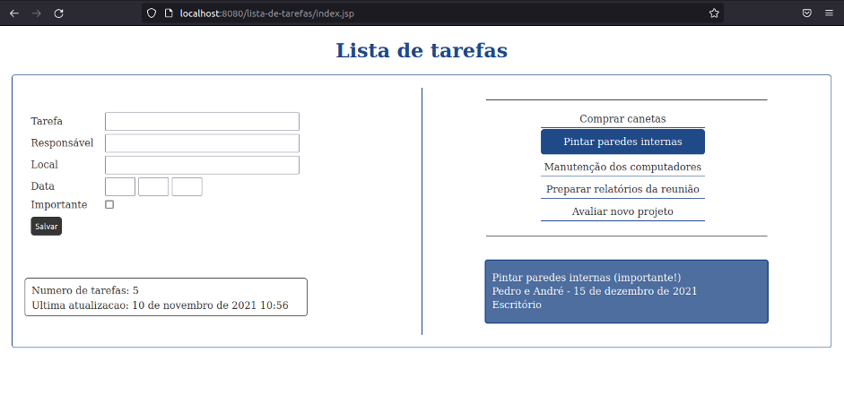

# Lista de tarefas

Este projeto apresenta uma lista de tarefas. A linguagem JavaScript foi utilizada a fim de compreender seus conceitos e sintaxe. Assim, além de praticar o seu uso foram trabalhadas questões como a manipulação de objetos, a criação dinâmica de elementos HTML e o tratamento de seus eventos.

# ⚙️ Tecnologias

- HTML5
- Javascript
- CSS3

# 🎨 Layout

